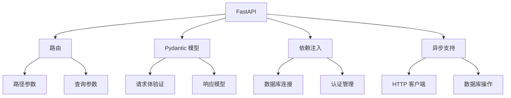

#### 核心优势（相比 Flask/Django）

1. **异步支持**：原生支持 `async/await`，高性能
2. **类型提示**：Python 类型提示自动校验请求/响应
3. **自动文档**：自动生成 OpenAPI 文档（Swagger UI 和 ReDoc）
4. **性能卓越**：接近 Node.js/Go 的速度（基于 Starlette 和 Pydantic）

### 1. 安装与环境

```bash
pip install fastapi uvicorn[standard]
```

### 2. 基础结构（对比 Flask/Django）

```python
# main.py
from fastapi import FastAPI

app = FastAPI()  # 类似 Flask 的 app = Flask(__name__)

@app.get("/")  # 路由装饰器类似 Flask
async def root():
    return {"message": "Hello World"}

# 运行命令：uvicorn main:app --reload
```

### 3. 核心功能快速掌握

#### 路径参数（类似 Flask）

```python
@app.get("/items/{item_id}")
async def read_item(item_id: int):  # 类型自动转换和验证
    return {"item_id": item_id}
```

#### 查询参数（自动解析）

```python
@app.get("/items/")
async def list_items(skip: int = 0, limit: int = 10):  # 默认值处理
    return {"skip": skip, "limit": limit}
```

#### 请求体（Pydantic 模型是核心）

```python
from pydantic import BaseModel

class Item(BaseModel):
    name: str
    description: str = None  # 可选参数
    price: float
    tax: float = None  # 可选参数

@app.post("/items/")
async def create_item(item: Item):  # 模型自动验证
    item_dict = item.dict()
    if item.tax:
        total = item.price + item.tax
        item_dict.update({"total": total})
    return item_dict
```

#### 响应模型（类似 Django DRF Serializers）

```python
@app.post("/items/", response_model=Item)  # 自动过滤未声明的字段
async def create_item(item: Item):
    return item
```

### 4. 异步支持（比 Flask 更简单）

```python
import httpx

@app.get("/github/{user}")
async def fetch_github(user: str):
    async with httpx.AsyncClient() as client:
        response = await client.get(f"https://api.github.com/users/{user}")
        return response.json()
```

### 5. 依赖注入（强大特性）

```python
from fastapi import Depends

def query_extractor(q: str = None):
    return q

@app.get("/search")
async def search(query: str = Depends(query_extractor)):
    return {"query": query}
```

#### 类形式依赖

```python
class Paginator:
    def __init__(self, page: int = 1, size: int = 10):
        self.page = page
        self.size = size

@app.get("/products")
async def list_products(paginator: Paginator = Depends()):
    return {"page": paginator.page, "size": paginator.size}
```

### 6. 中间件（类似 Flask/Django）

```python
@app.middleware("http")
async def add_process_time_header(request, call_next):
    start_time = time.time()
    response = await call_next(request)
    process_time = time.time() - start_time
    response.headers["X-Process-Time"] = str(process_time)
    return response
```

### 7. 错误处理

```python
from fastapi import HTTPException

@app.get("/protected")
async def protected_route(token: str):
    if token != "secret":
        raise HTTPException(
            status_code=401,
            detail="Invalid token",
            headers={"WWW-Authenticate": "Bearer"},
        )
    return {"access": "granted"}
```

#### 自定义异常处理器

```python
from fastapi.exceptions import RequestValidationError

@app.exception_handler(RequestValidationError)
async def validation_exception_handler(request, exc):
    return JSONResponse(
        status_code=400,
        content={"detail": "Invalid data", "errors": exc.errors()},
    )
```

### 8. 文件处理

```python
from fastapi import UploadFile, File

@app.post("/upload")
async def upload_file(file: UploadFile = File(...)):
    contents = await file.read()
    return {
        "filename": file.filename,
        "size": len(contents)
    }
```

### 9. 数据库集成（以 SQLAlchemy 为例）

```python
# 依赖项管理数据库会话
from sqlalchemy.orm import Session

def get_db():
    db = SessionLocal()
    try:
        yield db
    finally:
        db.close()

@app.get("/users/{user_id}")
async def get_user(user_id: int, db: Session = Depends(get_db)):
    return db.query(User).filter(User.id == user_id).first()
```

### 10. 安全认证（OAuth2 密码流）

```python
from fastapi.security import OAuth2PasswordBearer

oauth2_scheme = OAuth2PasswordBearer(tokenUrl="token")

@app.get("/users/me")
async def read_current_user(token: str = Depends(oauth2_scheme)):
    user = decode_token(token)  # 自定义解码逻辑
    return user
```

### 11. 自动文档

- **Swagger UI**：`http://localhost:8000/docs`
- **ReDoc**：`http://localhost:8000/redoc`


### 12. 部署生产

```bash
# 使用 Gunicorn + Uvicorn 工作进程
gunicorn -w 4 -k uvicorn.workers.UvicornWorker main:app
```

#### 推荐部署栈

1. **反向代理**：Nginx
2. **进程管理**：Gunicorn + Uvicorn
3. **容器化**：Docker（官方提供 Python 镜像）
4. **云服务**：AWS/GCP 或 Docker Swarm/Kubernetes

### 迁移技巧（Flask/Django → FastAPI）

1. **路由**：装饰器语法类似 Flask
2. **视图**：将同步函数改为 `async def`
3. **请求解析**：用 Pydantic 模型替代 Flask 的 `request.json`
4. **中间件**：FastAPI 中间件兼容 ASGI 标准
5. **依赖注入**：替代 Flask 的全局 `g` 对象

### 学习资源

1. [官方文档](https://fastapi.tiangolo.com/)（含中文）
2. [FastAPI GitHub](https://github.com/tiangolo/fastapi)
3. [Awesome FastAPI](https://github.com/mjhea0/awesome-fastapi)



**提示**：利用好 FastAPI 的自动文档和类型提示，开发效率可提升 2-3 倍！
